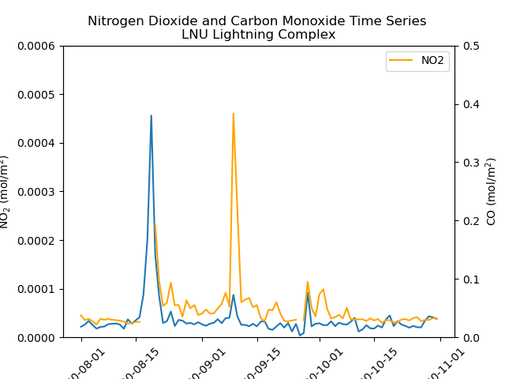
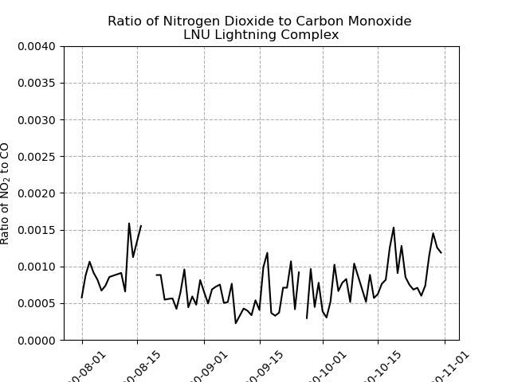
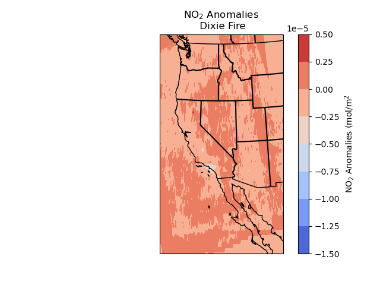

## Wildfire Information

| Indicator |   Fire Name    | Start Date |  End Date  |    Coordinates    | Acres Burned |                          Counties                           |
| ---- | -------------- | ---------- | ---------- | ----------------- | ------------ | ----------------------------------------------------------- |
| 1 | August Complex | 8/16/2020  | 11/11/2020 | (39.776,-122.673) | 1,032,648    | Mendocino, Humboldt, Trinity, Tehama, Glenn, Lake, & Colusa |
| 2 | SCU Lightning Complex | 8/16/2020  | 10/1/2020 | (37.439,-121.304) | 396,624    | Santa Clara County, Alameda County, Contra Costa County, San Joaquin County, Merced and Stanislaus County |
| 3 | LNU Lightning Complex | 8/17/2020  | 10/2/2020 | (38.481,-122.148) | 363,220    | Napa, Solano, Sonoma, Lake and Yolo |
| 4 | Dixie Fire | 7/13/2021  | 10/25/2021 | (39.871,-121.389) | 963,309    | Butte, Plumas, Shasta, Lassen and Tehama  |
| 5 | Monument Fire | 7/30/2021  | 10/26/2021 | (40.752,-123.337) | 223,124    | Trinity  |
| 6 | Caldor Fire | 8/14/2021  | 10/21/2021 | (38.586,-120.537) | 221,835    | El Dorado, Amador and Alpine    |
| 7 | River Complex | 7/30/2021  | 10/26/2021 | (41.389,-123.057) | 199,359    | Siskiyou and Trinity     |
| 8 | Antelope Fire | 8/1/2021  | 10/15/2021 | (41.528,-121.915) | 145,632    | Siskiyou     |
| 9 | McFarland Fire | 7/30/2021  | 9/16/2021 | (40.35,-123.034) | 122,653    | Shasta, Trinity and Tehama     |

## Wildfire Locations

## August Complex

| Nitrogen Dioxide | Carbon Monoxide | NO2 / CO Ratio |
| ---------------- | --------------- | ------------------------- |
|  |  |  |

| NO2 Anomalies | CO Anomalies |
| ------------------------ | ------------ |
|  |  |

| Time Series | Ratio Time Series |
| ----------- | ----------------- |
|  |  |

## SCU Lightning Complex

| Nitrogen Dioxide | Carbon Monoxide | NO2 / CO Ratio |
| ---------------- | --------------- | ------------------------- |
|  |  |  |

| NO2 Anomalies | CO Anomalies |
| ------------------------ | ------------ |
|  |  |

| Time Series | Ratio Time Series |
| ----------- | ----------------- |
|  |  |

## LNU Lightning Complex

| Nitrogen Dioxide | Carbon Monoxide | NO2 / CO Ratio |
| ---------------- | --------------- | ------------------------- |
|  |  |  |

| NO2 Anomalies | CO Anomalies |
| ------------------------ | ------------ |
|  |  |

| Time Series | Ratio Time Series |
| ----------- | ----------------- |
|  |  |

## Dixie Fire

| Nitrogen Dioxide | Carbon Monoxide | NO2 / CO Ratio |
| ---------------- | --------------- | ------------------------- |
|  |  |  |

| NO2 Anomalies | CO Anomalies |
| ------------------------ | ------------ |
|  |  |

| Time Series | Ratio Time Series |
| ----------- | ----------------- |
|  |  |
