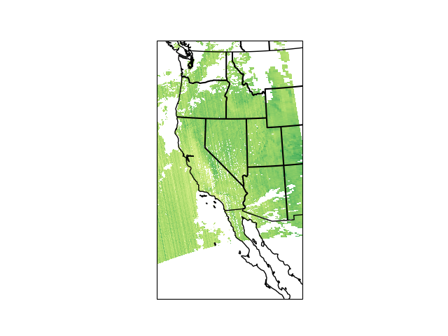
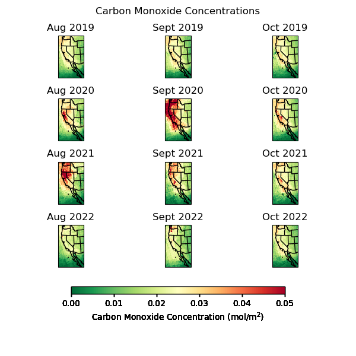
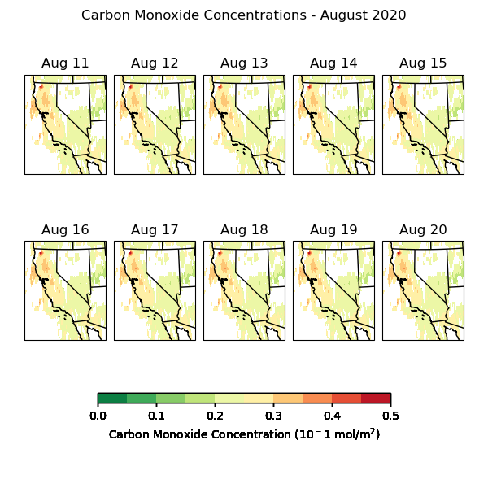
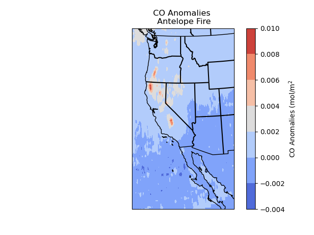

# Trends in Carbon Monoxide and Nitrogen Dioxide as Indications of Wildfires

[Research Proposal](https://averstynen.github.io/CLIM680Project/proposal.html)

## Introduction

For my project, I will be using measurements of nitrogen dioxide and carbon monoxide obtained from a polar-orbiting satellite.
I will be analyzing daily satellite observations during the months of August, September, and October for the years 2019-2021. I will specifically be focusing on the state of California.

During this time period, there were many wildfires in California of various sizes. This project will only look at wildfires that burned over 100 hectares. This limit was set due to the constraints of the satellite grid size. Some major wildfires of note during this period were the August Complex in 2019 and the Dixie Fire in 2018. Descriptions and extents of all fires observed will be detailed in the table provided below.

The goal of this project is to observe the ability of satellite-observed nitrogen dioxide and carbon monoxide values to indicate wildfires. Another goal of this project was to see if the ratio between nitrogen dioxide and carbon monoxide can be used as an indicator of a wildfire. The motivation for this is that there is a deficit in identifying wildfires based on atmospheric constituents. This limitation is due to the fact that wildfire emissions are very similar to those produced by cities and urban areas. 

## Data

My project will focus on data obtained from the Tropospheric Pollution Monitoring Instrument (TROPOMI) which is aboard the Sentinel-5 Precursor satellite. The satellite was launched in October 2017 and has data available from August 2019 to current. The instrument tracks multiple atmospheric constituents including aerosol layer height, carbon monoxide, formaldehyde, methane, nitrogen dioxide, and sulfur dioxide. These datasets have a resolution of
5.5km x 7km.

Because of the size of the dataset, I decided to crop the dataset to only include that which covers the state of California. For this project, I also only use the nitrogen dioxide and carbon monoxide datasets from the TROPOMI satellite. These two constituents make up a large portion of the emissions from wildfires. 

## Code and Implications

### [Slicing NetCDF file](https://averstynen.github.io/CLIM680Project/CropTROPOMI.ipynb)

The TROPOMI dataset consists of 25 swipes from pole to pole around the globe each day. Due to the large area covered by each swipe and the high resolution of the data, a single day of data was 1.5 GB. In order to download and work with a larger time range, I used this code to crop the orginal TROPOMI files down so that they only included the state of California and some surrounding areas. 

### [Regridding Data](https://averstynen.github.io/CLIM680Project/tropomi_regrid.ipynb)

After cropping the dataset, I had to regrid the data to a normal grid. Originally, the TROPOMI datasets are set using scanline and ground pixel coordinates. The dataset did have latitude and longitude as part of the coordinates, but not as part of the dimensions. Using this regridding code, I was able to plot the data onto a normal lat-long grid.

### [Plotting](https://averstynen.github.io/CLIM680Project/ClimateData_Project.ipynb)

This code is the one used to create the plots included in the results section. I used time slicing in order to select the dates of specific fires. I then took a time mean over those dates to create NO2 and CO plots for each fire. I also normalized the NO2 and CO values so that the plots were a range from 0 to 1. I then calculated anomalies of NO2 and CO values during the time of each wildfire compared to the full time period of August through October of the year of the fire. This study focuses on fires during the 2020 and 2021 seasons. The next calculation I did was dividing the NO2 values by the CO values to analyze the ratio of the constituents. The final step included in this code was using the "nearest" method in the sel function to choose the coordinates of the TROPOMI data that was the closest to the coordinates of the wildfire being observed. After doing this, I was able to create time series of NO2, CO, and the ratio between them. The plots and images associated with this section are included on the [Results](https://averstynen.github.io/CLIM680Project/Results.html) page.

### [Groupby](https://averstynen.github.io/CLIM680Project/CLIM680_HW2_Attempt2.ipynb)

Due to wildfires being isolated events in time, it was difficult to use a Groupby function for my dataset for the purposes of my research. There is the possibility of missing wildfire events due to grouping or cause bias in data if there is one large fire that appears in the groupby function but is not a good characteristic of the entire subset. That being said, I did use grouping to create monthly plots of CO concentrations. 

### [Subplots](https://averstynen.github.io/CLIM680Project/ClimateData_subplots.ipynb)

This code creates subplots that show the daily evolution of carbon monoxide over California. This can be used to show the impacts of wildfires on carbon monoxide concentrations. The current settings in the code are for a time span where there is a large area of wildfires starting in the middle of the time series. This way it can show the evolution of the CO concentrations before and after the fires start.

### [Anomalies](https://averstynen.github.io/CLIM680Project/ClimateData_Project.ipynb)

This code is discussed above in the plotting section. The anomalies were calculated as differences of each fire from the seasonal average. The plots are included in the [Results](https://averstynen.github.io/CLIM680Project/Results.html) section.

### [Functions](https://averstynen.github.io/CLIM680Project/ClimateData_Project.ipynb)

### [Animations](https://averstynen.github.io/CLIM680Project/TROPOMI_monthlygif.ipynb)

### [Composites](https://averstynen.github.io/CLIM680Project/CLIM680_HW3_Attempt2.ipynb)

## [Results](https://averstynen.github.io/CLIM680Project/Results.html)

## Summary

[NO2 Plots](https://averstynen.github.io/CLIM680Project/NO2.html)
