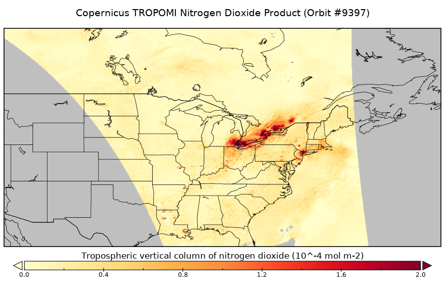

# Using TROPOMI Measurements as Indicators of Wildfires

For my final project, I will be using NO2 data from the Tropospheric Monitoring Instrument (TROPOMI) aboard the Sentinel-5 Precursor satellite.
I will be using daily satellite observations during the months of August, September, and October for the years 2019-2021. I will specifically be focusing
on the state of California.

During the months of August and September 2020, there were two large fires that impacted regions of California. Using the TROPOMI satellite, we are able to
observe column measurements of nitrogen dioxide, carbon monoxide, ozone, and Formaldehyde. This project will focus mainly on nitrogen dioxide and carbon
monoxide.

The main point of this project is to show how NO2 and CO can be used as indicators of a wildfire. The satellite images obtained from TROPOMI can also be used to show the extent to which the smoke and atmospheric constituents released by the fire can travel. This can help us understand health and community impacts of wildfires in locations farther from the source region.

The above image shows a sample plot of TROPOMI NO2 data. I plan on creating similar plots but over the state of California. In addition to daily plots such as the one pictured above, I also plan on calculating weekly averages to show how the concentrations of NO2 and CO compare during the lifespan of a fire. My final plan for this data is to compare years that were considered high fire seasons to years that were considered low fire seasons. This could be an indication of long-term impacts of wildfires.
